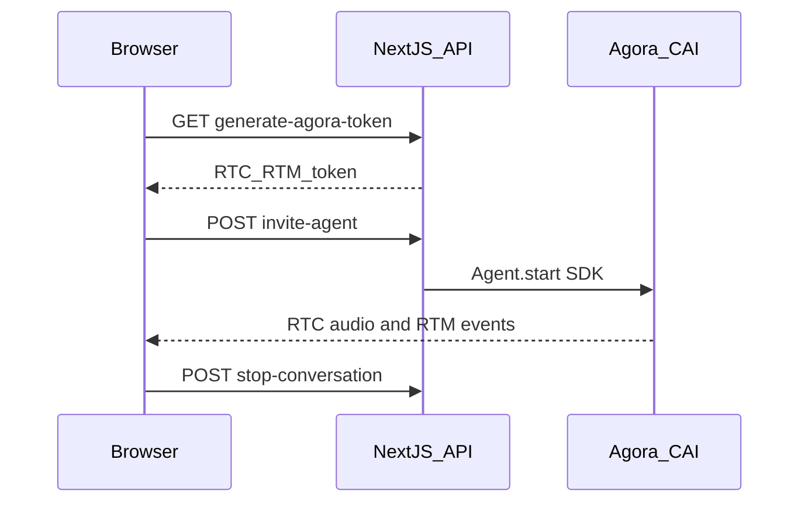

# Nexora Voice Assistant

Real-time voice AI built with [Agora Conversational AI](https://docs.agora.io/en/conversational-ai/overview/product-overview) and the official [agent-quickstart-nextjs](https://github.com/AgoraIO-Conversational-AI/agent-quickstart-nextjs) architecture: **RTC + RTM**, Agent Server SDK, live transcript, and pipeline metrics.

**Deploy:** [nexora-voice-ai.vercel.app](https://nexora-voice-ai.vercel.app)

## Prerequisites

- **Node.js 22+**
- **pnpm**
- Agora project with **RTC** and **Conversational AI** enabled
- Optional: [Agora CLI](https://github.com/AgoraIO/cli) for `agora project doctor --deep`

## Quick start (local)

```bash
cp .env.example .env.local
# Fill NEXT_PUBLIC_AGORA_APP_ID and NEXT_AGORA_APP_CERTIFICATE

pnpm install
pnpm run doctor
pnpm dev
```

Open [http://localhost:3000](http://localhost:3000) → **Start conversation** → allow microphone.

Or bind env via CLI:

```bash
agora login
agora project use <your-project>
agora project env write .env.local
agora project doctor --deep
pnpm dev
```

## Vercel environment variables

Set in **Production** and **Preview**:

| Variable | Required | Notes |
|----------|----------|--------|
| `NEXT_PUBLIC_AGORA_APP_ID` | Yes | Console → App ID |
| `NEXT_AGORA_APP_CERTIFICATE` | Yes | Console → App Certificate (server only) |
| `NEXT_PUBLIC_AGENT_UID` | No | Default `123456`; must match server invite |
| `NEXT_AGENT_GREETING` | No | Opening line |

**Legacy fallbacks** (optional): `AGORA_APP_ID`, `AGORA_APP_CERTIFICATE` — same values as above.

**Remove** (no longer used): `AGORA_CUSTOMER_ID`, `AGORA_CUSTOMER_SECRET`, `AGORA_AGENT_PRESET`, `OPENAI_API_KEY`, `AGENT_LLM_MODEL`.

**Vercel project settings:** Node.js **22.x**. Install command: `pnpm install`. Build: `pnpm run build`.

## Architecture



- **RTC** — microphone and assistant voice
- **RTM** — transcript, agent state, `AGENT_METRICS`, errors
- **Agent Server SDK** — start/stop cloud agent (no Customer ID/Secret)

## API routes

| Route | Method | Description |
|-------|--------|-------------|
| `/api/generate-agora-token` | GET | RTC + RTM token |
| `/api/invite-agent` | POST | Start Conversational AI agent |
| `/api/stop-conversation` | POST | Stop agent |
| `/api/tools` | POST | Optional n8n webhook stub |

## Commands

```bash
pnpm dev          # dev server (webpack)
pnpm run build    # production build
pnpm run doctor   # local env check
pnpm run verify   # doctor + lint + typecheck + API contracts + build
```

## Troubleshooting

| Issue | Action |
|-------|--------|
| Agent silent, mic works | Run `agora project doctor --deep`; check Analytics agent **Sender** / your **Receiver** |
| RTM login fails | Token route must use `buildTokenWithRtm` (already in this repo) |
| Agent never joins | `NEXT_PUBLIC_AGENT_UID` must match `getAgentUid()` / invite route |
| No transcript | RTM must be enabled on agent (`enable_rtm: true`) |

### Mobile (Chrome / Safari on phone)

- **Transcript above the orb** on small screens — scroll if needed; pipeline chips hide below `sm` width.
- **Microphone prompt** appears as soon as you tap **Start Conversation** (before the call connects). If you never saw it, check Chrome site settings → Microphone → Allow, reload, and try again. In-call **Allow microphone** appears if the track failed to start.
- If you hear nothing, tap **Tap to hear agent** (required on most phones for assistant audio).
- If you see “Live transcript is unavailable”, RTM failed but **voice may still work**.
- **iOS Safari**: use latest iOS; disable silent mode; prefer Safari over in-app browsers (Instagram, etc.).

See [AGENTS.md](./AGENTS.md) and Agora [DOCS](https://github.com/AgoraIO-Conversational-AI/agent-quickstart-nextjs/tree/main/DOCS).

## License

Private — configure per your project.
