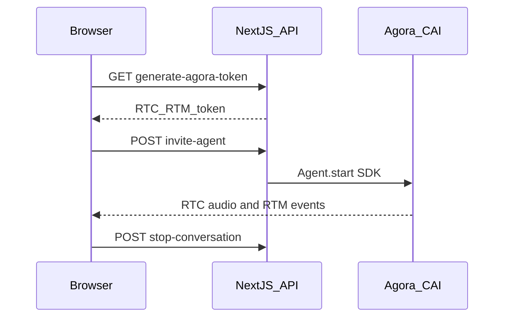

# Nexora Voice Assistant

Real-time voice AI built with [Agora Conversational AI](https://docs.agora.io/en/conversational-ai/overview/product-overview) and the official [agent-quickstart-nextjs](https://github.com/AgoraIO-Conversational-AI/agent-quickstart-nextjs) architecture: **RTC + RTM**, Agent Server SDK, live transcript, and pipeline metrics.

**Deploy:** [nexora-voice-ai.vercel.app](https://nexora-voice-ai.vercel.app)

## Prerequisites

- **Node.js 22+**
- **pnpm**
- Agora project with **RTC** and **Conversational AI** enabled
- Optional: [Agora CLI](https://github.com/AgoraIO/cli) for `agora project doctor --deep`

## Quick start (local)

```bash
cp .env.example .env.local
# Fill NEXT_PUBLIC_AGORA_APP_ID and NEXT_AGORA_APP_CERTIFICATE

pnpm install
pnpm run doctor
pnpm dev
```

Open [http://localhost:3000](http://localhost:3000) → **Start conversation** → allow microphone.

Or bind env via CLI:

```bash
agora login
agora project use <your-project>
agora project env write .env.local
agora project doctor --deep
pnpm dev
```

## Vercel environment variables

Set in **Production** and **Preview**:

| Variable | Required | Notes |
|----------|----------|--------|
| `NEXT_PUBLIC_AGORA_APP_ID` | Yes | Console → App ID |
| `NEXT_AGORA_APP_CERTIFICATE` | Yes | Console → App Certificate (server only) |
| `NEXT_PUBLIC_AGENT_UID` | No | Default `123456`; must match server invite |
| `NEXT_AGENT_GREETING` | No | Opening line (spoken after delay, not on join) |
| `NEXT_AGENT_GREETING_DELAY_MS` | No | Default `5000` — wait before opening line |
| `NEXT_LLM_API_KEY` | **Yes (production)** | OpenAI API key — cloud agent LLM (fixes error 505 / LLM 401) |
| `NEXT_LLM_URL` | No | Default `https://api.openai.com/v1/chat/completions` |
| `NEXT_DEEPGRAM_API_KEY` | No | BYOK STT if needed |
| `NEXT_MINIMAX_API_KEY` | No | BYOK TTS if needed |
| `NEXT_MINIMAX_GROUP_ID` | No | Required with MiniMax key |
| `AGORA_ENABLE_TOOLS` | No | `true` to wire MCP tools on the cloud agent |
| `NEXORA_MCP_PUBLIC_URL` | When tools on | Public HTTPS base (Agora calls `{url}/api/mcp`) |
| `MCP_AUTH_TOKEN` | Recommended | Bearer auth for `/api/mcp` |
| `N8N_TOOL_WEBHOOK_URL` | When tools on | Default n8n webhook for `invoke_workflow` |
| `N8N_WEBHOOK_SECRET` | Recommended | `X-Webhook-Secret` to n8n |
| `AGORA_WEBHOOK_SECRET` | Recommended | Verify Agora Console notification signatures |

**Legacy fallbacks** (optional): `AGORA_APP_ID`, `AGORA_APP_CERTIFICATE`, `OPENAI_API_KEY` (same as `NEXT_LLM_API_KEY`).

See [DOCS/N8N_TOOLS.md](./DOCS/N8N_TOOLS.md) and [DOCS/WEBHOOKS.md](./DOCS/WEBHOOKS.md) for tool and webhook setup.

**Remove** (no longer used): `AGORA_CUSTOMER_ID`, `AGORA_CUSTOMER_SECRET`, `AGORA_AGENT_PRESET`, `AGENT_LLM_MODEL`, `AGENT_GREETING_MESSAGE`, `AGENT_GREETING_DELAY_MS`, `AGENT_SYSTEM_PROMPT` (system instructions live in `lib/invite-agent-pipeline.ts`).

**Vercel project settings:** Node.js **22.x**. Install command: `pnpm install`. Build: `pnpm run build`.

## Architecture


```mermaid
sequenceDiagram
  participant Browser
  participant API as NextJS_API
  participant Cloud as Agora_CAI

  Browser->>API: GET generate-agora-token
  API-->>Browser: RTC_RTM_token
  Browser->>API: POST invite-agent
  API->>Cloud: Agent.start SDK
  Cloud-->>Browser: RTC audio and RTM events
  Browser->>API: POST stop-conversation
```

- **RTC** — microphone and assistant voice
- **RTM** — transcript, agent state, `AGENT_METRICS`, errors
- **Agent Server SDK** — start/stop cloud agent (no Customer ID/Secret)

## API routes

| Route | Method | Description |
|-------|--------|-------------|
| `/api/generate-agora-token` | GET | RTC + RTM token |
| `/api/invite-agent` | POST | Start Conversational AI agent |
| `/api/stop-conversation` | POST | Stop agent |
| `/api/tools` | POST | Manual n8n tool bridge (testing) |
| `/api/mcp` | GET/POST/DELETE | Streamable HTTP MCP for Agora cloud tools |
| `/api/session-fields` | GET/POST | Form-captured email for `send_email` workflows |
| `KV_REST_API_URL` / `KV_REST_API_TOKEN` | When tools on (Vercel) | **Required on Vercel** so form email is visible to MCP `get_session_fields` |
| `/api/webhooks/agora` | POST | Agora Console session notifications |

## Commands

```bash
pnpm dev          # dev server (webpack)
pnpm run build    # production build
pnpm run doctor   # local env check
pnpm run verify   # doctor + lint + typecheck + API contracts + build
```

## Troubleshooting

| Issue | Action |
|-------|--------|
| **LLM 401 / error 505** (intermittent) | Agora reseller key in Console **or** `NEXT_LLM_API_KEY` in Vercel; refresh often left orphan agents — fixed by deferred invite + session cleanup |
| Agent silent, mic works | Run `agora project doctor --deep`; check Analytics agent **Sender** / your **Receiver** |
| RTM login fails | Token route must use `buildTokenWithRtm` (already in this repo) |
| Agent never joins | `NEXT_PUBLIC_AGENT_UID` must match `getAgentUid()` / invite route |
| No transcript | RTM must be enabled on agent (`enable_rtm: true`) |

### All browsers (including phones)

- **Start Conversation** only opens the call after **RTM** (live transcript) connects — same as the [official quickstart](https://github.com/AgoraIO-Conversational-AI/agent-quickstart-nextjs).
- **Mobile Chrome / Android**: the cloud agent is invited **after** you join the RTC channel (avoids the agent joining an empty room while the phone is still connecting).
- **Transcript above the orb** on small screens — scroll if needed.
- **Microphone**: allow when prompted; Chrome → lock icon → Site settings → Microphone → Allow.
- If you hear nothing after the agent joins, tap **Tap to hear agent** (browser autoplay policy applies on every device).
- **iOS Safari**: use latest iOS; disable silent mode; prefer Safari over in-app browsers.

See [AGENTS.md](./AGENTS.md) and Agora [DOCS](https://github.com/AgoraIO-Conversational-AI/agent-quickstart-nextjs/tree/main/DOCS).

## License

Private — configure per your project.
